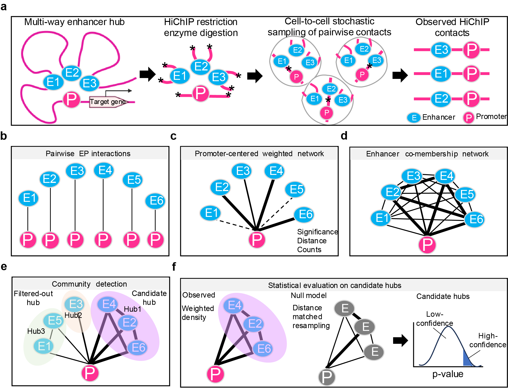

# PEhub

**PEhub** is a R package for identifying and characterizing **multi-way enhancer hubs** from HiChIP chromatin interaction data.
It resolves higher-order enhancer cooperation as **promoter-anchored regulatory units**, enabling quantitative analysis of hub architecture, stability, and statistical significance.

---

## Key Features

* **Promoter-centric modeling** of enhancer cooperation
* Detection of **multi-way enhancer hubs** beyond pairwise loops
* Flexible **weighting schemes** (distance-, signal-, and bin-aware)
* **Leiden clustering** on enhancer co-membership graphs
* **Bootstrap-based stability** assessment
* **Distance-aware null models** for global hub p-values
* Fully **CLI-driven**, reproducible end-to-end workflow
* Designed for **HiChIP / H3K27ac HiChIP / Hi-C–derived loops**

---

## Conceptual Overview

PEhub reframes enhancer hub detection as a **local, promoter-conditioned problem**.

Instead of clustering a global chromatin interaction graph, PEhub:

1. Anchors all interactions at individual promoters
2. Builds **weighted enhancer–enhancer co-membership matrices**
3. Partitions enhancers into hubs using **Leiden community detection**
4. Quantifies hub strength, density, stability, and statistical significance

> 📌 **Figure**:
> A schematic overview of the PEhub workflow is shown below.


---

## Contents

- [Installation](#installation)
- [Get the example data](#get-the-example-data)
- [Quick start: run everything at once](#quick-start-run-everything-at-once)
- [Step by step](#step-by-step)
- [Output files](#output-files)
- [Parameters](#parameters)
- [Weighting schemes](#weighting-schemes)
- [Troubleshooting](#troubleshooting)
- [Function reference](#function-reference)

---

## Installation

### Option A: conda (recommended for most users)

The simplest path — conda provides R, Python, and all system libraries prebuilt,
so nothing needs to compile:

```bash
mamba create -n pehub -c conda-forge \
    r-base=4.4 r-devtools bioconductor-rtracklayer zlib python=3.13
mamba activate pehub
```

Then in R:

```r
remotes::install_github("YidanSunResearchLab/PEhub")
```

### Option B: existing R installation

If you already have R >= 4.4 and python >= 3.11 set up:

```r
if (!requireNamespace("BiocManager", quietly = TRUE)) install.packages("BiocManager")
BiocManager::install("YidanSunResearchLab/PEhub")
BiocManager::install("rtracklayer")
```

### Python package is handled for you

Community detection uses the Python `leidenalg` library. PEhub provisions an
isolated conda environment for it automatically via
[basilisk](https://bioconductor.org/packages/basilisk/), the first time you run
hub detection. **You never install or configure Python.**

The first run takes a few minutes while that environment is built. Every run
afterwards reuses it.

## Get the example data

The example dataset (GM12878 H3K27ac HiChIP, chromosome 9) lives in the
repository rather than inside the package, because of its size. Clone the
repository to get it:

```bash
git clone https://github.com/YidanSunResearchLab/PEhub.git
cd PEhub
ls example_data/
```

```
genes.chr9.gtf.gz
hicdcplus.significant_interactions.bedpe
hicdcplus.all_interactions.bedpe.gz
```

Three files, which is exactly what PEhub needs:

| File | What it is |
| --- | --- |
| `hicdcplus.significant_interactions.bedpe` | Significant loops, with a `qvalue` column (here from HiC-DC+) |
| `hicdcplus.all_interactions.bedpe.gz` | The full interaction set. Supplies the distance-matched null pool |
| `genes.chr9.gtf.gz` | Gene annotation, used to locate promoters |

Run everything below from the cloned directory, so that the relative paths work.

---

## Quick start: run everything at once

Save this as `run_PEhub.R` and run it with `Rscript run_PEhub.R`.

```r
#!/usr/bin/env Rscript
suppressPackageStartupMessages({
  library(PEhub)
  library(rtracklayer)
  })

## ---- 1. Build the TSS annotation from the GTF ----
gtf <- rtracklayer::import("example_data/genes.chr9.gtf.gz")
tx  <- gtf[gtf$type == "transcript"]
tss <- GenomicRanges::resize(tx, width = 1, fix = "start")
message("Got ", length(tss), " TSS records")

## ---- 2. Run all four stages ----
result <- pehub_run(
  loop_file        = "example_data/hicdcplus.significant_interactions.bedpe",
  loop_file_all    = "example_data/hicdcplus.all_interactions.bedpe.gz",
  outdir           = "results",
  tss_input        = tss,
  filename         = "GM12878test",

  weight_method    = "bin_log_ratio_sig",
  method           = "log_minmax",
  promoter_window  = 0,
  k_min            = 3,
  resolution       = 1.0,
  quantile_cutoff  = 0.2,

  B_pvalue         = 10000,
  B_stability      = 10,
  null_mode        = "hist_matched",
  pvalue_cutoff    = 0.05,
  stability_cutoff = 0.5,
  workers          = 10
)
```

### What you should see

```
Building observed weighted co-membership networks...
Step 1: total promoter number = 197
Fast co-membership 197
[1] "Running Leiden clustering for each promoter..."
Total 214 promoter-hub
[1] "Running observed counts for each promoter..."
Finally detecting 214 clusters
[1] "Start the heavy step, calculating global p-values for each hub..."
[1] "Finished calculating global p-values."
Stage 3 complete: 171 candidate hubs evaluated
[1] "Starting post-processing: GM12878test"
[1] "Postprocessing done."
Stage 4 complete: 32 high-confidence hubs (unadjusted p < 0.05); 7 high-confidence hubs (FDR < 0.05). Exported to results/
High-confidence hubs (p-value): 32
High-confidence hubs (FDR):     7
```

With `B_pvalue = 10000` and `workers = 10`, the null model is the slow part —
expect a few minutes. Lower `B_pvalue` (e.g. `1000`) for a faster first look.

PEhub always exports **two sets of results** simultaneously:

- **p-value set** : passes unadjusted empirical `p < 0.05` and `reproducibility_rate >= 0.5`. This is the recommended set for most analyses, as it retains reproducible hubs that are individually significant against the null model.
- **FDR set** : passes Benjamini–Hochberg `q < 0.05` and `reproducibility_rate >= 0.5`. The stricter set, correcting for the number of hubs tested. Use this when a more conservative multiple-testing correction is required.

Your results are now in `results/`. Skip to [Output files](#output-files).

---

## Step by step

`pehub_run()` calls four stages in order. Running them separately lets you
inspect intermediate results, and re-run a later stage with different thresholds
without repeating the expensive earlier ones.

Every stage writes an `.RData` checkpoint to `outdir` **and returns** its key
objects, so you never have to `load()` anything by hand.

Start an R session in the cloned directory:

```r
suppressPackageStartupMessages({
  library(PEhub)
  library(rtracklayer)
  })

OUTDIR   <- "results"
SAMPLE   <- "GM12878test"
```

### Step 0 — Build the TSS annotation

```r

gtf <- rtracklayer::import("example_data/genes.chr9.gtf.gz")
tx  <- gtf[gtf$type == "transcript"]
tss <- GenomicRanges::resize(tx, width = 1, fix = "start")
message("Got ", length(tss), " TSS records")
```

### Step 1 — Prepare interactions

Annotates each loop anchor as promoter (P) or enhancer (E) against the TSS, and
assembles the promoter-anchored enhancer–promoter tables. The background file
supplies the distance-stratified pool that the null model draws from later.

```r
prep <- pehub_prepare_interactions(
  loop_file       = "example_data/hicdcplus.significant_interactions.bedpe",
  loop_file_all   = "example_data/hicdcplus.all_interactions.bedpe.gz",
  outdir          = OUTDIR,
  tss_input       = tss,
  filename        = SAMPLE,
  promoter_window = 0
)
```

Inspect what came out:

```r
head(prep$prep_hichip$loops)     # significant EP interactions
nrow(prep$prep_hichip$loops)

head(prep$all_ep_data$loops)     # background EP interactions (null pool)
```

**Writes:** `results/multiple_result.GM12878test.hub.all.preprocess.RData`

### Step 2 — Detect candidate hubs

Scores every EP contact, builds each promoter's enhancer co-membership network,
partitions it with Leiden, and keeps the highest-ranking community — the one with
the greatest total node strength — as that promoter's candidate hub.

This is the stage that invokes Python. The first time you run it, basilisk builds
its environment; be patient.

```r
hubs <- pehub_detect_hubs(
  outdir          = OUTDIR,
  filename        = SAMPLE,
  weight_method   = "bin_log_ratio_sig",
  method          = "log_minmax",
  k_min           = 3,
  resolution      = 1.0,
  quantile_cutoff = 0.2,
  B_pvalue        = 10000
)
#> Finally detecting 214 clusters
```

```r
nrow(hubs$hub1)          # one candidate hub per promoter
#> [1] 214

head(hubs$hub1[, c("promoter_id", "hub_id", "size", "internal_score")])

hubs$hubs                # all communities, including filtered-out ones
```

`k_min = 3` is a definitional lower bound, not a tunable threshold: two enhancers
is a pairwise contact, so three is the smallest set in which multi-way
co-membership can exist.

**Writes:** `results/multiple_result.GM12878test.hub.log_minmax.bin_log_ratio_sig.preprocess.RData`

### Step 3 — Evaluate hubs

Two independent tests, merged onto the hub table:

1. an **empirical p-value** against the distance-matched null model, and
2. a **reproducibility rate** from bootstrap re-discovery.

```r
ev <- pehub_evaluate_hubs(
  outdir           = OUTDIR,
  filename         = SAMPLE,
  weight_method    = "bin_log_ratio_sig",
  method           = "log_minmax",
  k_min            = 3,          # must match step 2
  resolution       = 1.0,        # must match step 2
  quantile_cutoff  = 0.2,        # must match step 2
  B_pvalue         = 10000,
  B_stability      = 10,
  null_mode        = "hist_matched"
)
#> [1] "Hub stability number: 171"
#> [1] "Start the heavy step, calculating global p-values for each hub..."
#> [1] "Finished calculating global p-values."
#> [1] "Pvalue num FDR<0.05 hubs: 7"
#> Stage 3 complete: 171 candidate hubs evaluated
```

`k_min`, `resolution` and `quantile_cutoff` **must match step 2**, because hubs
are re-discovered from resampled data during bootstrapping.

Look at the statistics:

```r
summary(ev$hub1$hub_p_value_global)     # unadjusted empirical p
summary(ev$hub1$hub_p_adj_global)       # Benjamini–Hochberg q
summary(ev$hub1$reproducibility_rate)   # fraction of bootstraps recovering the hub
summary(ev$hub1$OE_ratio_global)        # observed hub score / null median
```

How many hubs would pass, under each definition:

```r
sum(ev$hub1$hub_p_value_global < 0.05 &
    ev$hub1$reproducibility_rate >= 0.5, na.rm = TRUE)   # the default filter
#> [1] 32

sum(ev$hub1$hub_p_adj_global < 0.05, na.rm = TRUE)       # FDR alone
#> [1] 7
```

**Writes:** `results/multiple_result.GM12878test.hub.log_minmax.bin_log_ratio_sig.RData`

### Step 4 — Classify and export

Applies both sets of thresholds and writes all output files. This step only
filters, so you can re-run it with different cutoffs in seconds without
repeating steps 1–3.

```r
out <- pehub_export_hubs(
  outdir           = OUTDIR,
  filename         = SAMPLE,
  weight_method    = "bin_log_ratio_sig",
  method           = "log_minmax",
  pvalue_cutoff    = 0.05,
  stability_cutoff = 0.5
)
#> [1] "Starting post-processing: GM12878test"
#> [1] "High-confidence hubs (p < 0.05, stability >= 0.5): 32"
#> [1] "High-confidence hubs (FDR < 0.05, stability >= 0.5): 7"
#> [1] "Postprocessing done."
#> Stage 4 complete: 32 high-confidence hubs (unadjusted p < 0.05); 7 high-confidence hubs (FDR < 0.05). Exported to results/
```

Both result sets are returned directly — no need to read files:

```r
nrow(out$high_confidence_pval)   # hubs passing unadjusted p < 0.05
#> [1] 32
nrow(out$high_confidence_fdr)    # hubs passing FDR q < 0.05
#> [1] 7

head(out$high_confidence_pval)
head(out$high_confidence_fdr)

out$files      # paths of all 12 output files
```

Each row in the hub table is one promoter hub. Key columns:

```r
out$high_confidence_pval[, c("promoter_id", "hub_id", "promoter_gene_name",
                              "size", "internal_score", "weighted_density",
                              "hub_p_value_global", "hub_p_adj_global",
                              "OE_ratio_global", "reproducibility_rate")]
```

### Free the Python process

```r
pehub_shutdown()
```

Optional — it also happens automatically when the session ends.

---

## Output files

Step 4 writes **12 files** to `results/`. The filename contains a tag that
identifies which filter was applied:

- `.pvalue.` — hubs passing unadjusted `p < 0.05` and `reproducibility_rate >= 0.5` (32 hubs in the example)
- `.fdr.` — hubs passing BH-adjusted `q < 0.05` and `reproducibility_rate >= 0.5` (7 hubs in the example)

With `filename = "GM12878test"`, `method = "log_minmax"` and
`weight_method = "bin_log_ratio_sig"`:

| File | Contents |
| --- | --- |
| `multiple_result.GM12878test.hub.log_minmax.bin_log_ratio_sig.pvalue.bed` | High-confidence hub regions (p-value set) |
| `multiple_result.GM12878test.hub.log_minmax.bin_log_ratio_sig.pvalue.txt` | Hub table with all statistics (p-value set) |
| `multiple_result.GM12878test.hub.log_minmax.bin_log_ratio_sig.pvalue.bedpe` | Hub EP interactions (p-value set) |
| `multiple_result.GM12878test.pairwise.log_minmax.bin_log_ratio_sig.pvalue.bed/txt/bedpe` | Interactions not in a p-value hub |
| `multiple_result.GM12878test.hub.log_minmax.bin_log_ratio_sig.fdr.bed` | High-confidence hub regions (FDR set) |
| `multiple_result.GM12878test.hub.log_minmax.bin_log_ratio_sig.fdr.txt` | Hub table with all statistics (FDR set) |
| `multiple_result.GM12878test.hub.log_minmax.bin_log_ratio_sig.fdr.bedpe` | Hub EP interactions (FDR set) |
| `multiple_result.GM12878test.pairwise.log_minmax.bin_log_ratio_sig.fdr.bed/txt/bedpe` | Interactions not in an FDR hub |

Intermediate checkpoints:

| File | Written by |
| --- | --- |
| `multiple_result.GM12878test.hub.all.preprocess.RData` | Step 1 |
| `multiple_result.GM12878test.hub.<method>.<weight>.preprocess.RData` | Step 2 |
| `multiple_result.GM12878test.hub.<method>.<weight>.RData` | Step 3 |

### Hub table columns

Each row in `.txt` is one promoter hub. The key columns:

| Column | Meaning |
| --- | --- |
| `promoter_id` | Peak ID of the promoter anchor (e.g. `peak_chr1_100034_100040`) |
| `hub_id` | Unique hub identifier (`<promoter_id>_hub1`) |
| `promoter_gene_name` | Gene name(s) associated with the promoter |
| `promoter_gene_id` | Ensembl gene ID(s) |
| `promoter_transcript_id` | All transcript IDs overlapping the promoter anchor |
| `size` | Number of enhancers in the hub |
| `internal_score` | Summed internal co-membership edge weight — measures how densely the enhancers co-occur (cohesion) |
| `weighted_density` | `internal_score` ÷ number of possible enhancer pairs; normalises cohesion for hub size |
| `avg_non_zero_weight` | Mean edge weight among non-zero co-membership edges |
| `graph_density` | Fraction of possible edges that are non-zero |
| `jaccard_stability_score` | Mean Jaccard similarity between the original hub and its bootstrap replicates |
| `reproducibility_rate` | Fraction of bootstraps that recover this hub (Jaccard ≥ 0.5); the stability filter uses this column |
| `existence_rate` | Fraction of bootstraps in which the promoter forms any hub at all |
| `hub_p_value_global` | Unadjusted empirical p against the distance-matched null model |
| `hub_p_adj_global` | Benjamini–Hochberg FDR q-value across all tested hubs |
| `hub_score_obs_global` | Observed hub co-membership score |
| `hub_score_null_median` | Median null hub score across permutations |
| `OE_ratio_global` | `hub_score_obs_global` ÷ `hub_score_null_median`; enrichment of co-occurrence over the null |

---

## Parameters

### Inputs

| Parameter | Meaning |
| --- | --- |
| `loop_file` | Significant interactions, BEDPE, with a `qvalue` column |
| `loop_file_all` | Full interaction set; supplies the null pool. May be gzipped |
| `tss_input` | `GRanges` of TSS positions with a `gene_id` column |
| `outdir` | Output directory; created if absent |
| `filename` | Sample name; prefixes every output file |

### Hub construction

| Parameter | Default | Meaning |
| --- | --- | --- |
| `promoter_window` | `0` | Half-width in bp around each TSS. `0` uses the TSS itself |
| `weight_method` | `"bin_log_ratio_sig"` | How each contact is scored — see below |
| `method` | `"log_minmax"` | Normalisation of the co-membership matrix |
| `k_min` | `3` | Minimum enhancers per promoter. A definitional lower bound: two enhancers is a pairwise contact |
| `resolution` | `1.0` | Leiden granularity. Hub definitions are stable up to `1.0`; above it they progressively fragment |
| `quantile_cutoff` | `0.2` | Co-membership edges below this quantile of non-zero weights are removed |

### Statistical evaluation

| Parameter | Default | Meaning |
| --- | --- | --- |
| `B_pvalue` | `1000` | Permutations for the distance-matched null |
| `B_stability` | `10` | Bootstrap iterations for reproducibility |
| `null_mode` | `"hist_matched"` | Preserves each hub's distance-bin composition when resampling. `"global"` draws from the whole pool |
| `pvalue_cutoff` | `0.05` | Significance threshold |
| `stability_cutoff` | `0.5` | Minimum fraction of bootstraps recovering the hub |

### Execution

| Parameter | Default | Meaning |
| --- | --- | --- |
| `workers` | `1` | Parallel workers for the null model. Requires `future` and `furrr`; without them the same computation runs serially, with identical results |

---

## Weighting schemes

Each enhancer–promoter contact is scored from three features: **contact count**,
**statistical significance** (−log₁₀ q), and **genomic distance**. Eleven schemes
combine these differently.

```r
pehub_weight_schemes()
```

Each enhancer–promoter contact is scored from three features: **contact count**,
**statistical significance** (−log₁₀ q), and **genomic distance**. Eleven schemes
combine these differently. Call `pehub_weight_schemes()` to retrieve this table
as a data frame.

| Category | Label | Code | Formula | Description |
| --- | --- | --- | --- | --- |
| Single-feature | Count | `count_only` | log(count) | Raw contact frequency |
| Single-feature | Significance | `sig_only` | −log₁₀(q) | Statistical confidence, capped |
| Single-feature | Distance | `distance_only` | 1/log(1+d) | Distance-based weight; negative control |
| Combined evidence | Count-Significance | `count_sig` | count × sig | Count weighted by significance |
| Combined evidence | Count-Significance-Distance | `count_sig_plus_dist_linear` | linear combination | Linear integration of all three features |
| Model-based | Z-score residual | `zscore_residual` | standardized residual | Standardized HiC-DC+ background residual |
| Distance-corrected | Distance-adjusted percentile | `bin_percentile` | percentile within bin | Percentile rank of count within distance bins |
| Distance-corrected | Distance-adjusted percentile-significance | `bin_percentile_plus_sig` | percentile × sig | Distance percentile weighted by significance |
| Distance-corrected | Distance-adjusted excess signal | `bin_diff_global` | observed − expected | Contact excess over distance-bin expectation |
| Distance-corrected | Distance-adjusted excess signal normalized | `bin_diff_binmax` | normalized to bin max | Bin-normalized excess signal |
| Distance-corrected | **Distance-adjusted log-enrichment** ✓ | **`bin_log_ratio_sig`** | **log(observed/expected) × sig** | **Log enrichment over distance-bin expectation, weighted by significance — default** |

`bin_log_ratio_sig` is the default because:
- the log ratio is **dimensionless** and comparable across distance scales
- the log transform limits the influence of extreme contact counts
- multiplying by significance down-weights interactions with weak statistical support

---

## Troubleshooting

**The first run is slow.** basilisk is building the Python environment. This
happens once; later runs reuse it.

**`installation of Python X.Y.Z failed`** — basilisk tried to compile CPython
from source. PEhub sets `BASILISK_USE_CONDA=1` when it loads, to avoid this. If
you still see it, set the variable yourself *before* loading the package:

```r
Sys.setenv(BASILISK_USE_CONDA = "1")
library(PEhub)
```

**`replacing previous import 'data.table::first' by 'dplyr::first'`** — harmless.
`data.table`, `dplyr` and `igraph` export some identically named functions; the
messages simply record which one wins.

**Hub calls differ from a previous analysis.** Leiden results depend on the
`leidenalg` version. Check that `R/basilisk.R` pins the same version as the
environment your earlier results came from:

```r
reticulate::py_list_packages()   # in the old environment
```

---

## Function reference

### Pipeline

| Function | Stage |
| --- | --- |
| `pehub_run()` | All four stages |
| `pehub_prepare_interactions()` | 1 — annotate anchors, build EP tables |
| `pehub_detect_hubs()` | 2 — weights, co-membership, Leiden, candidate hubs |
| `pehub_evaluate_hubs()` | 3 — null-model p-values, bootstrap reproducibility |
| `pehub_export_hubs()` | 4 — threshold, classify, export |

### Utilities

| Function | Purpose |
| --- | --- |
| `read_tss_from_gtf()` | Build a TSS `GRanges` from a GTF/GFF file |
| `build_tss_from_txdb()` | Build a TSS `GRanges` from a `TxDb` |
| `pehub_weight_schemes()` | Table of the eleven weighting schemes |
| `pehub_shutdown()` | Release the Python process |

### Lower-level building blocks

For users assembling a custom workflow.

| Function | Purpose |
| --- | --- |
| `preprocess_hichip()` | Annotate anchors and build the EP table |
| `compute_weights()` | Apply a weighting scheme to an EP table |
| `fast_comembership()` | Build the co-membership matrix for one promoter |
| `build_hubs_from_EP()` | Detect hubs directly from an EP table |
| `run_leiden_for_promoter()` | Leiden partition for a single promoter |
| `calculate_hub_stability()` | Bootstrap reproducibility |

Documentation for any function:

```r
?pehub_detect_hubs
help(package = "PEhub")
```

---

## Citation

> Tan J., Sun Y. PEhub reveals the hierarchical organization of multi-way
> enhancer hubs in the human brain.

## License

MIT